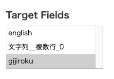
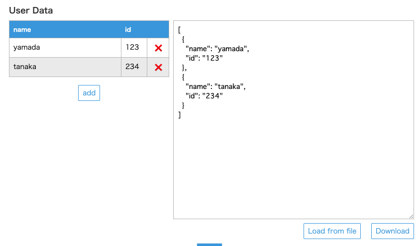
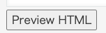
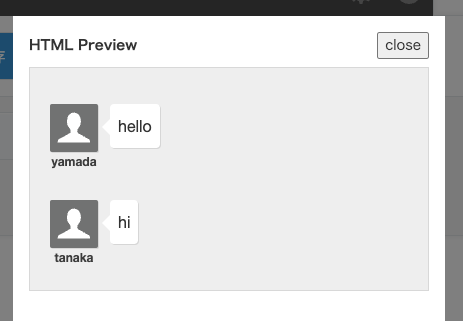

# kintone-plugin-yomiyasuin

## usage

## format

```
### ■ gijiroku
yamada：hello
tanaka：hi
```

Use `：` (Fullwidth Colon) to separate names and statements.

| char | Unicode | JIS X 0213 | entity                | name                           |
| ---- | ------- | ---------- | --------------------- | ------------------------------ |
| `：`   | U+FF1A  | 1-1-7      | `&#xFF1A;` `&#65306;` | コロン（全角） fullwidth colon |

[コロン (記号)/符号位置](<https://ja.wikipedia.org/wiki/%E3%82%B3%E3%83%AD%E3%83%B3_(%E8%A8%98%E5%8F%B7)#%E7%AC%A6%E5%8F%B7%E4%BD%8D%E7%BD%AE>)

## plugin config

### Target Fields

Select field-code which you want to apply the plugin.



By using Shift+Click, you can select multiple field-code.

### User Data

User Data is a setting that ties a name to an id.

The id of the kintone user can be identified from the id contained in the URL of the profile image.

For example, if the URL of the profile image is `/api/user/photo.do/-/user.png?id=123`, the id is 123.

#### add User Data

Click `add` button or edit JSON string directly.



#### Load from file

It is also possible to read User Data from a JSON file (`.json` or `.txt`).

#### Download User Data as JSON file

Click the `Download` button to save the UserData as a JSON file.

## preview on edit page and create page

For the Create Record page and the Edit Record page.

Click the Preview HTML button to display the preview.





## develop commands

### develop

```
npm run start
```

### upload

```
npm run upload
```

### pack

```
npm run pack
```

### build

```
npm run compile
```
